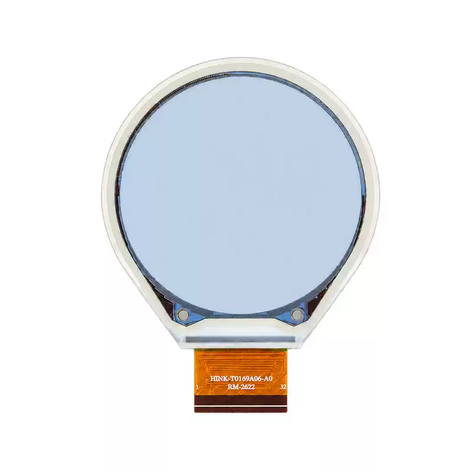

<p align="left"></p>

<h1 align="center">OSPTEK 1.69″ EPD 400×400（IST7601CA0 · SPI）</h1>

<p align="center"><b>圆形六色电子纸 · SPI · IST7601CA0</b></p>

<p align="center"><a href="./README_EN.md">English</a> | 简体中文 · <a href="../../README.md">规格族索引</a></p>

<p align="center">
  
  
  
  
</p>

<p align="center"></p>

## 目录

- [产品简介](#产品简介)
- [规格参数](#规格参数)
- [示例工程](#示例工程)
- [仓库结构](#仓库结构)
- [相关资料](#相关资料)
- [购买链接](#购买链接)
- [技术支持](#技术支持)

---

## 产品简介

OSPTEK **1.69 寸 400×400 EPD** 是一款 **SPI** 接口圆形六色电子纸模组，驱动为 **IST7601CA0**。适用于穿戴、工卡与低功耗物联网显示。

规格标识（仓库名）：`epd-1.69-400x400-spi-ist7601`

当前模组版本：**EPD0169A06**。电气与外形细节以 [`docs/EPD0169A06.pdf`](./docs/EPD0169A06.pdf) 为准。

## 规格参数

| 项目 | 规格 |
| ---- | ---- |
| 尺寸 | 1.69 英寸 |
| 类型 | 圆形六色电子纸（黑 / 白 / 红 / 黄 / 蓝 / 绿） |
| 分辨率 | 400×400 |
| 接口 | SPI |
| 驱动 IC | IST7601CA0 |

> 完整外形尺寸、FPC 定义、供电与时序以产品规格书 / 驱动手册为准。

## 示例工程

| 说明 | 路径 |
| ---- | ---- |
| ESP32-S3 · S3 DEMO 底板 · IST7601 SPI 六色电子纸 | [`examples/esp32s3-idf5_ist7601-spi/`](./examples/esp32s3-idf5_ist7601-spi/) |

## 仓库结构

```text
epd-1.69-400x400-spi-ist7601/             # 仓库根（导航见 ../../README.md）
└── versions/
    └── EPD0169A06/                       # 本料号完整资料
        ├── README.md
        ├── README_EN.md
        ├── images/
        ├── docs/
        └── examples/
```

## 相关资料

### 本产品资料

| 资料 | 链接 |
| ---- | ---- |
| 产品规格书 | [`docs/EPD0169A06.pdf`](./docs/EPD0169A06.pdf) |
| 1.69 寸六色墨水屏转接板（适配 S3 DEMO 底板） | [`docs/1.69寸6色墨水屏转接板_适用于S3 DEMO底板.pdf`](./docs/1.69%E5%AF%B86%E8%89%B2%E5%A2%A8%E6%B0%B4%E5%B1%8F%E8%BD%AC%E6%8E%A5%E6%9D%BF_%E9%80%82%E7%94%A8%E4%BA%8ES3%20DEMO%E5%BA%95%E6%9D%BF.pdf) |

### 示例工程

- [ESP32-S3 · S3 DEMO 底板 · IST7601 SPI](./examples/esp32s3-idf5_ist7601-spi/)

## 购买链接

<p align="center">
  <a href="https://shop110742373.taobao.com/"></a>
  &nbsp;&nbsp;
  <a href="https://www.aliexpress.com/store/1105701619"></a>
</p>

**国内（淘宝）**

- 店铺：[鱼鹰光电工厂店](https://shop110742373.taobao.com/)

**海外（AliExpress）**

- 店铺：[OSPTEK Official Store](https://www.aliexpress.com/store/1105701619)

## 技术支持

- 技术支持 / 产品咨询：<luyu@osptek.com>
- QQ 技术交流群：**985881096**
- 公司官网：<https://osptek.com/>
- 有任何问题，都可以在本仓库 Issues 中提问

---

<p align="center"><sub>© 2026 OSPTEK 鱼鹰光电 · 本仓库资料采用 CC BY 4.0 许可</sub></p>
